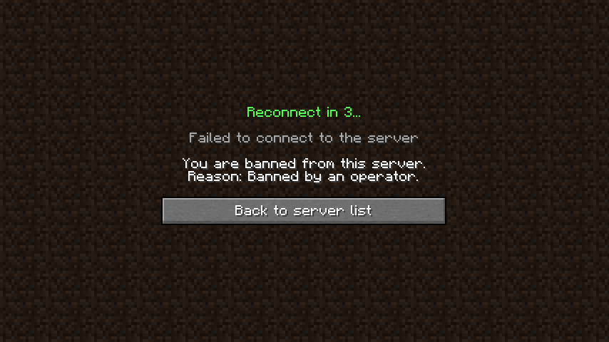
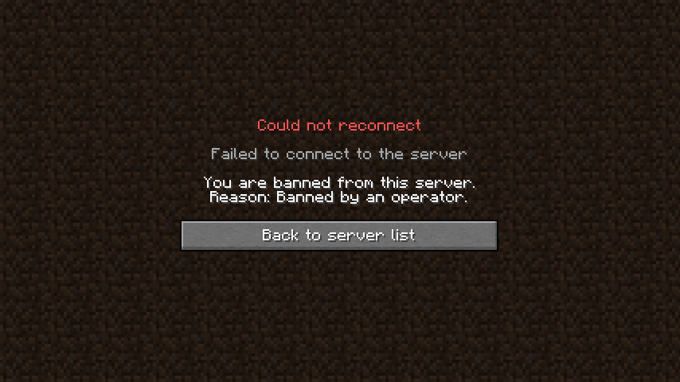

# AutoReconnect [1.16+][Fabric]

This mod will automatically try to reconnect you back to a server if you got disconnected.
By default, it will make 4 attempts after 3, 10, 30 and 60 seconds.

### Features

* Multiple individually delayed reconnect attempts
* Displays a countdown on the disconnect screen
* Allows you to exit the disconnect screen quickly by pressing the escape key
* Customizable
    * Amount of attempts
    * Delay between each attempt
* Client side commands
    * `/autoreconnect reload` Reloads the config and displays the settings in chat
    * `/autoreconnect config [<delayList>]` Sets the delay between each attempt 
    `[<delayList>]` must be a Nbt List Tag containing Integers, e.g. `[3, 10, 30, 60]` or `[I;3, 10, 30, 60]`
* Support for several mods

### Installation

1. [Download](https://fabricmc.net/use/) and install Fabric
2. Download [Fabric API]() and put the jar file into the mods folder
3. Do the same for this mod

### Compatibility

* [ModMenu](https://www.curseforge.com/minecraft/mc-mods/modmenu)  
  Properly shows the mod icon, name and author
  and provides a link for the curseforge project page and the github issues page
* [AuthMe](https://www.curseforge.com/minecraft/mc-mods/auth-me)  
  Pauses the countdown if you click on the Re-authenticate button to revalidate the session of the game

### Common questions

* _Can I change the delay?_ 
  Yes, you finally can with the latest version of this mod.
* _Forge version?_ 
  Simply no. I am not interested in developing mods using Forge.
* _Version for 1.13.x or lower?_ 
  Fabric does not exist for those versions.
* _Version for 1.14.x or 1.15.x?_ 
  If there is enough demand for it I might make a version for those versions of the game.

### Screenshots

### License

This mod is available under the CC0 license.
Feel free to learn from it and incorporate it in your own projects.
If you actually just copy code or use this mod in a mod pack I would appreciate it if you mention me
by linking the github page or the curseforge project page.