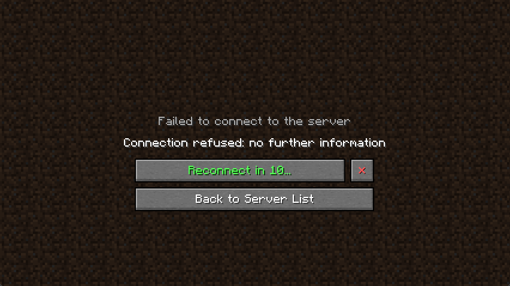
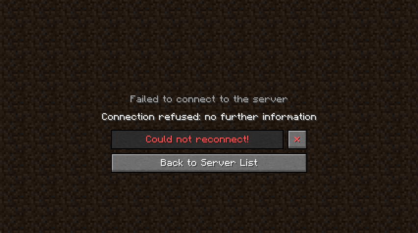
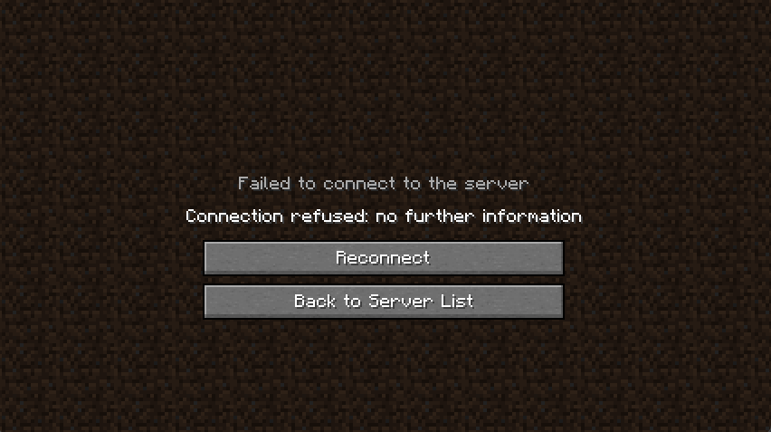
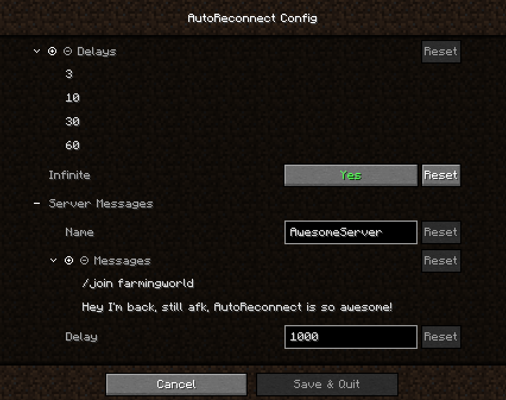

# AutoReconnect [1.18.x][Fabric][Client]

### Description

This mod will automatically try to reconnect you back to a server if you got disconnected.
By default, it will make 4 attempts after 3, 10, 30 and 60 seconds.

### Features

* Additional button on the Disconnect Screen which will reconnect you without having to go back to the menu first
* AutoReconnect
  * Automatically reconnect after getting disconnected
  * Multiple attempts
  * Individual delays
  * Infinite attempts (Optional, repeats last attempt)
  * Manual reconnect still possible
  * Countdown is showing and can be canceled
* AutoMessage
  * Automatically send messages after reconnecting, e.g., to join a certain lobby or just say hi to your friends ;P
  * Delay between messages and before the first one
  * Targets specific server, realm or singleplayer world identified by its name (for details see below)
  * Only executed after automatic reconnects and not if you reconnect manually or if it hasn't even been a reconnect
* Works for Multiplayer, Realms and even for Singleplayer!
* Extras
  * In-game configuration through [Mod Menu](https://www.curseforge.com/minecraft/mc-mods/modmenu) 
  * Support [Mod Menu](https://www.curseforge.com/minecraft/mc-mods/modmenu) and [AuthMe](https://www.curseforge.com/minecraft/mc-mods/auth-me) (for details see below) 
  * Disconnect Screen (like many other screens) can be exited by pressing escape
  * After being disconnected from a singleplayer world, you won't end up on the Multiplayer Screen ([Bug MC-46502](https://bugs.mojang.com/browse/MC-45602)) 

### Installation

1. Download and install [Fabric](https://fabricmc.net/use/) and set up the profile the way you want
2. Download the following mods and put them in the mod folder:
   * [Fabric API](https://www.curseforge.com/minecraft/mc-mods/fabric-api)
   * [ClothConfig](https://www.curseforge.com/minecraft/mc-mods/cloth-config)
   * [AutoReconnect](https://www.curseforge.com/minecraft/mc-mods/autoreconnect)
   * [Mod Menu](https://www.curseforge.com/minecraft/mc-mods/modmenu) (Optional but highly recommended)

### Compatibility/Support

* [Mod Menu](https://www.curseforge.com/minecraft/mc-mods/modmenu)
  * Properly shows the mod icon, name and author
  and provides a link for the curseforge project page and the github issues page
  * Graphical user interface to configure the mod in-game
* [AuthMe](https://www.curseforge.com/minecraft/mc-mods/auth-me)
  * Countdown for automatic reconnect will stop if you're re-authenticating to revalidate your session

### Details

* Automatic reconnects
  * Attempts can be configured by adding strictly positive values (delay in seconds) to the list of delays. For each value in that list a delayed attempt will be made to reconnect you.
  * Can be disabled by simple not configuring any attempts. Only manual reconnects are possible then.
* Automatic messages
  * Will only be executed if an automatic reconnect attempt has been made, so you didn't click on the reconnect button yourself.
  * Targets a specific server, realm or singleplayer world. Enter the name of the server, realm or singleplayer in the configuration.
  * A delay can be configured (in milliseconds). This delay will be the same between every message and even the first one and the moment you joined.

### Future plans

* Allow multiple AutoMessage targets so that different messages will be sent when reconnecting to different servers, realms or singleplayer worlds
* Custom configuration screen and potentially drop the cloth-config dependency
  * Improve the user experience
  * Allow more complex config to make the first point possible to configure
* I'm _not_ planning to port this mod to forge

### Feedback, Suggestions, Bugs & Issues

* For feedback and suggestions please write a comment on [curseforge](https://www.curseforge.com/minecraft/mc-mods/autoreconnect)
* If you found a bug or an issue, write a comment on [curseforge](https://www.curseforge.com/minecraft/mc-mods/autoreconnect) or open an issue on [github](https://github.com/Bstn1802/AutoReconnect/issues). Make sure to give a detailed description of the issue and post the latest logs, or a potential crash report, preferably by using something like [pastebin](https://pastebin.com/).

### Screenshots

