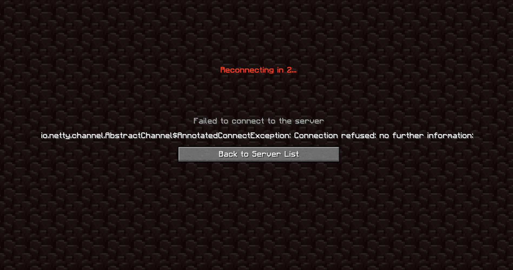
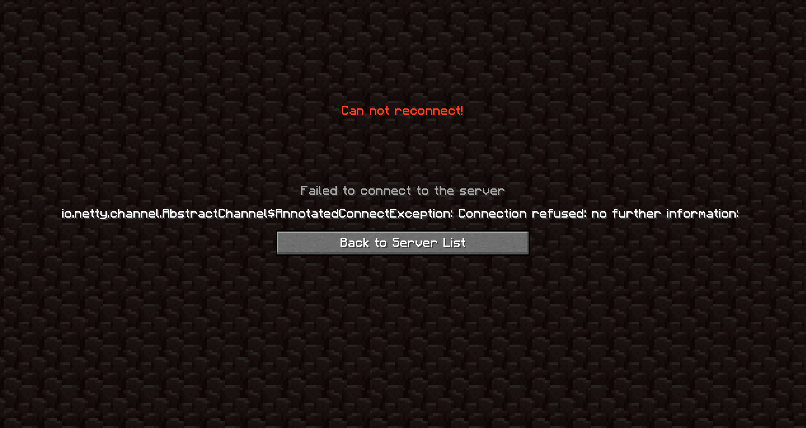

# AutoReconnect

### It's a fork of auto-reconnect mod.

### Description

A configuration placed in *.minecraft/config/config/autoreconnect.yaml*
If this file is not present, start the game

Configuration contains some int's
It's list of time to reconnect

(Btw you can exit the disconnect screen with <kbd>Esc</kbd>)

### Screenshots

(Mod doesn't change the background or the font, I was using a resource pack when I took the screenshots)

### License

This mod is available under the CC0 license. Feel free to learn from it and incorporate it in your own projects.
